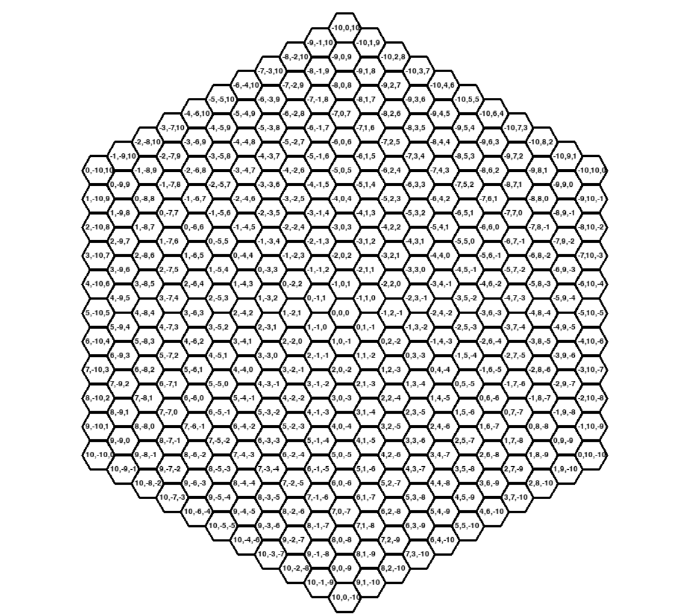

# WG-Forge bot client project by ***Game wizards***
#### ***Game wizards*** members:
- ##### Željko Tanjević ([Github](https://github.com/Zeljko103))
- ##### Veljko Deljanin ([Github](https://github.com/VeljkoDeljanin))
- ##### Olegas Borisovas ([Github](https://github.com/Olegas123))

---
#### Project description
&emsp; The main idea of our task/project is to develop a bot client for a turn-based strategy game, that is based on the original World of Tanks game. The game, can be played by up to three players who control five different types of vehicles with their own properties. 
&emsp; The map is made out of hexagons (See picture below. [Hex map](#game-map)) and the main task of each player/bot is to conquer their opponents by either capturing a central base or destroying as many enemy vehicles as possible.

---

#### Running our bot client:
&emsp; For our bot client assembling and running we currently use PyCharm IDE, link can be found [here](https://www.jetbrains.com/pycharm/). 
&emsp; To launch our project using PyCharm IDE, follow the following steps: 
&emsp;&emsp;&emsp; 1) Download/clone our project.  
&emsp;&emsp;&emsp;&emsp;&emsp; 1.1) If project was downloaded, you should have a zipped project file. Just extract it to a folder. 
&emsp;&emsp;&emsp;&emsp;&emsp; 1.2) If project was cloned, you should already have required folder, so you're ready to go further. 
&emsp;&emsp;&emsp; 2) Open project folder using IDE, in our case, we just open it in PyCharm IDE. 
&emsp;&emsp;&emsp;&emsp; :warning::warning::warning:   Make sure, that you have a required Python version installed, as well as a pygame library added. 
&emsp;&emsp;&emsp; 3) If IDE is not returning any error messages (if everything is installed correctly), just run main file. 
&emsp;&emsp;&emsp; 4) In opened window, fill in required fields and proceed. And congrats, now you should see how bot plays the game. 
&emsp;&emsp;&emsp; 5) After the game will finish, program will inform you about the results of the game. 

---

#### Short description of main bot client components:
&emsp; Bot client is written in Python 3.11 programming language. Also, it requires installed "pygame" library, which is required to draw and update our map. 
&emsp; Our bot client consists of main following parts: 
&emsp;&emsp;&emsp; [1) Communication with server](#communication-with-server) 
&emsp;&emsp;&emsp; [2) Bot/player logic](#botplayer-logic) 
&emsp;&emsp;&emsp; [3) Map](#game-map) 
&emsp;&emsp;&emsp; [4) Main game loop](#main-game-loop) 

---

#### Communication with server

&emsp;Our communication with server is made in game-client.py, which communicates with the server using socket connection. The client sends requests to and gets from server in the form of binary messages which are encoded as a byte stream.  

&emsp;The implementation also defines two enums, Action and Result, which are required to identify the different types of actions that can be performed by the client, and the possible results that can be returned by the server. 

---

#### Bot/player logic
&emsp; The bot client/player logic is located at player_ folder. In this folder, there is a main logic of movement and shooting of tanks. 

---

#### Game map
&emsp; Game map is made out of hexagons, which each have x, y and z coordinates. The middle of the map has coordinates - (0, 0, 0). For better understanding, in the following picture we can see all our map coordinates. 

 
&emsp; Hex map, which represents current game state, is being drawn using python library called "pygame". 
&emsp; In our implementation, map.py is responsible for drawing, updating, coloring of the map. Also, it has a specific methods, that checks hexagon/hexagons if we need something. 

---

#### Main game loop
&emsp; Main game loop is launched when all players are connected in order to start a game. 
&emsp; Game.py is the most important part of our program, because it combines all previous steps in order to allow bot client work properly. 

---
